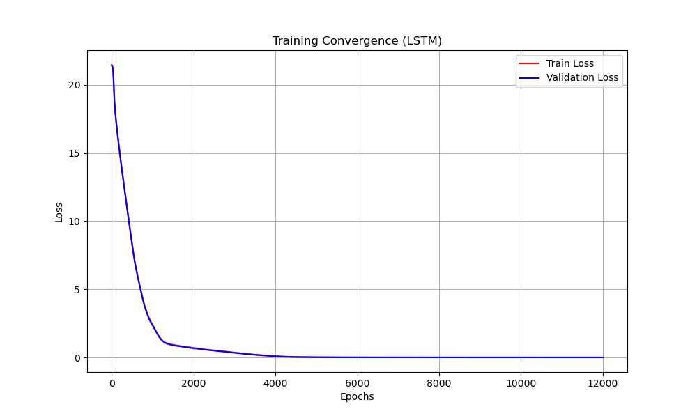
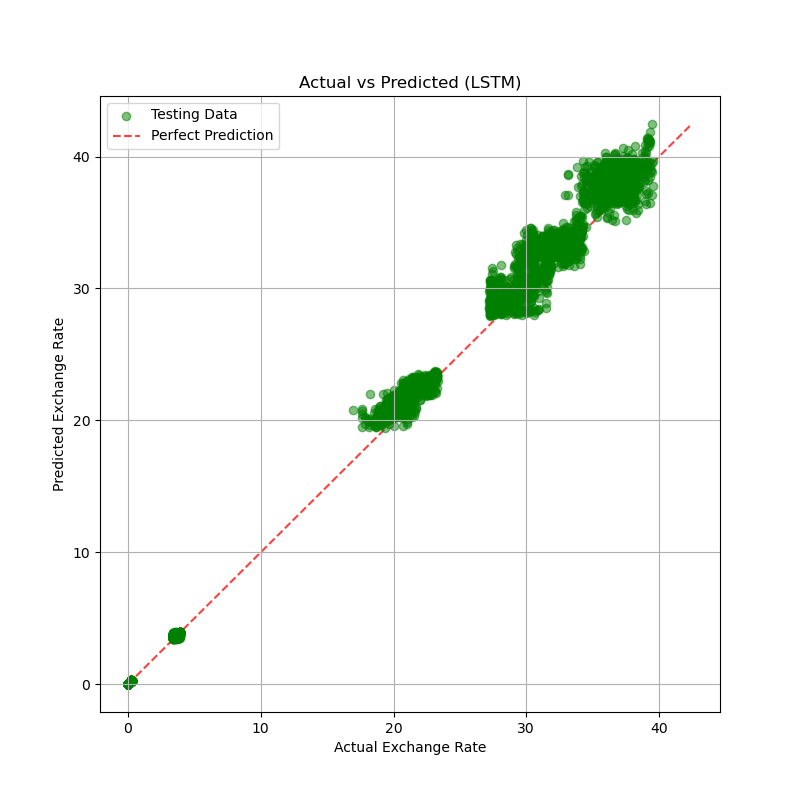
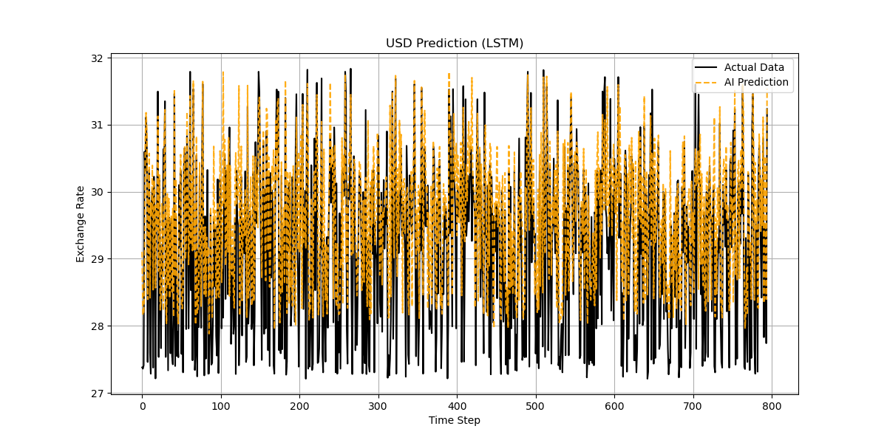

# 💱 AI-Powered Multi-Currency Exchange Rate Prediction
# 基於 LSTM 的多國匯率預測系統


## 📖 Project Overview (專案簡介)
This project implements a Deep Learning solution to predict the **Cash Buy Rates (現鈔買入)** of **8 major currencies** (USD, JPY, EUR, GBP, AUD, CAD, HKD, KRW) against TWD.

Starting from a baseline **Linear Regression**, the project evolved through **Deep MLP** architectures and culminated in a robust **LSTM (Long Short-Term Memory)** model. The final model achieves a validation loss of **0.0125 (HuberLoss)**, successfully capturing market momentum and eliminating the "lag effect" common in simpler models.

> **Data Source Note:** The dataset used in this project was provided as part of the **Artificial Intelligence Course** curriculum for educational purposes.
> (**資料來源說明：** 本專案使用的數據集為人工智慧課程提供的教學資料，僅供學術研究與模型驗證使用。)

本專案實作了一個深度學習解決方案，用於預測 **8 種主要貨幣**（美金、日圓、歐元等）對台幣的 **「現鈔買入」** 匯率。
專案從基礎的 **線性回歸 (Linear Regression)** 起步，經過 **深層多層感知機 (Deep MLP)** 的迭代，最終採用具備時序記憶能力的 **LSTM** 模型。最終模型在驗證集上達到了 **0.0125 (HuberLoss)** 的低誤差，成功捕捉市場動能並解決了傳統模型常見的「滯後效應」。

---

## 📊 Key Results & Performance (核心成果)

> **Note:** The following visualizations are generated from the LSTM model.
> (註：以下圖表皆由最終的 LSTM 模型生成。)

### 1. The "Perfect" Convergence (完美收斂)
The model demonstrates stable training dynamics using **HuberLoss** and an **Adaptive Learning Rate Scheduler**.
透過 **HuberLoss** 與 **自適應學習率調度器**，模型展現了極佳的訓練穩定性。


*The L-shaped curve indicates rapid learning with no signs of overfitting.* (L 型曲線顯示學習迅速且無過擬合跡象。)

### 2. High Precision Across Currencies (跨幣別高精度)

* **X-Axis:** Actual Exchange Rate (實際匯率)
* **Y-Axis:** Predicted Exchange Rate (預測匯率)
* **Insight:** The tight alignment along the 45-degree diagonal proves the model generalizes well across both low-value currencies (e.g., JPY) and high-value currencies (e.g., GBP).
* **分析：** 數據點緊密貼合 45 度對角線，證明模型無論是對低價幣（如日圓）還是高價幣（如英鎊）皆具備優異的泛化能力。

### 3. Capturing Real Market Momentum (捕捉市場動能 - 以 USD 為例)

* **Black Line:** Actual Rates (實際值)
* **Orange Line:** LSTM Prediction (預測值)
* **Critical Observation:** Unlike baseline models that merely "shadow" the previous day's price, the LSTM model accurately predicts **turning points** synchronously.
* **關鍵觀察：** 不同於僅會「複製昨日價格」的基準模型，LSTM 展現了預測 **趨勢轉折點** 的能力，實現了與市場走勢的同步。

---

## 🛠️ Model Evolution & Ablation Study (模型演進與消融實驗)

I conducted a rigorous comparative analysis to select the best architecture.
我進行了嚴謹的比較分析，以選出最佳的模型架構。

| Model (模型) | Val Loss | Characteristics (特性) | Verdict (結論) |
|-------------|----------|-------------------|---------|
| **Linear Regression** | **0.0105** | Lowest loss, but high **Lag**. Learned $P_{t+1} \approx P_t$. <br> (誤差最低，但有嚴重滯後，僅學會複製昨日價格) | ❌ Baseline Only (僅作基準) |
| **Deep MLP (256 nodes)**| ~0.0180 | Good fit but noisy. Suffered from "jitter". <br> (擬合尚可但雜訊多，預測曲線呈鋸齒狀) | ⚠️ Unstable (不穩定) |
| **LSTM (Proposed)** | **0.0125** | **Best Balance.** Captures temporal dependencies. <br> (最佳平衡，成功捕捉時間序列依賴性) | ✅ **Selected (最終選擇)** |

### 💡 Why LSTM over Linear Regression? (為什麼選擇 LSTM？)
Although Linear Regression achieved a slightly lower numerical loss (0.0105 vs 0.0125), visual analysis revealed it was performing **"Lagged Prediction"**.
The **LSTM model**, despite a marginally higher loss, demonstrated **predictive foresight** by reacting to trends synchronously, making it the only viable model for real-world trading strategies.

雖然線性回歸的數值誤差略低，但視覺分析顯示其僅是在做「滯後預測」（圖形向右平移一天）。
**LSTM 模型** 雖然誤差略高，但展現了 **預測前瞻性**，能與趨勢同步反應，這才是真實交易策略中真正可用的模型。

---

## ⚙️ Technical Architecture (技術架構)

### Data Pipeline (資料管線)
* **Input:** 5-Day Sliding Window (Sequence Length = 5). (5日滑動視窗)
* **Features:** 32 features per day (4 rate types × 8 currencies). (每日32特徵)
* **Preprocessing:** Z-Score Normalization (StandardScaler). (標準化處理)

### Final LSTM Configuration (最終配置)
* **Structure:** 2-Layer LSTM (Hidden Dim: 64) + FC Output.
* **Loss Function:** `nn.HuberLoss` (Robust against outliers). (抗極端值)
* **Optimizer:** Adam (`lr=5e-4`) + Weight Decay (`5e-6`).
* **Scheduler:** `ReduceLROnPlateau` (Patience=1500, Factor=0.3).
* **Regularization:** Dropout (0.1) to prevent overfitting. (防止過擬合)

---

## 💻 How to Run (如何執行)

1.  **Clone the repository (複製專案)**
    ```bash
    git clone https://github.com/benji1216/currency-prediction.git
    
    cd currency-prediction
    ```

2.  **Install dependencies (安裝套件)**
    ```bash
    pip install -r requirements.txt
    ```

3.  **Run Training (執行訓練)**
    You can switch models (Linear/Deep/LSTM) by modifying the config in `train.py`.
    你可以透過修改 `train.py` 中的設定來切換不同模型。
    ```bash
    # Open train.py and set MODEL_TYPE = "LSTM" or "Linear"
    python train.py
    ```

4.  **View Output (查看結果)**
    * **Results:** `output/` directory contains prediction CSVs.
    * **Images:** `images/` directory contains generated charts.
    * **預測結果：** CSV 檔案存於 `output/`。
    * **圖表：** 生成的圖表存於 `images/`。

---

## 📂 Project Structure (檔案結構)
```text
currency-prediction/
├── train/               # Training Data CSVs (訓練資料資料夾)
├── test/                # Testing Data CSVs (測試資料資料夾)
├── images/              # Generated Plots (生成的圖表)
├── output/              # Prediction results (預測結果輸出)
├── models.py            # PyTorch Model Definitions (模型定義)
├── utils.py             # Data Loading & Visualization (資料讀取與畫圖)
├── train.py             # Main training script (主訓練程式)
└── requirements.txt     # Python dependencies (套件清單)
